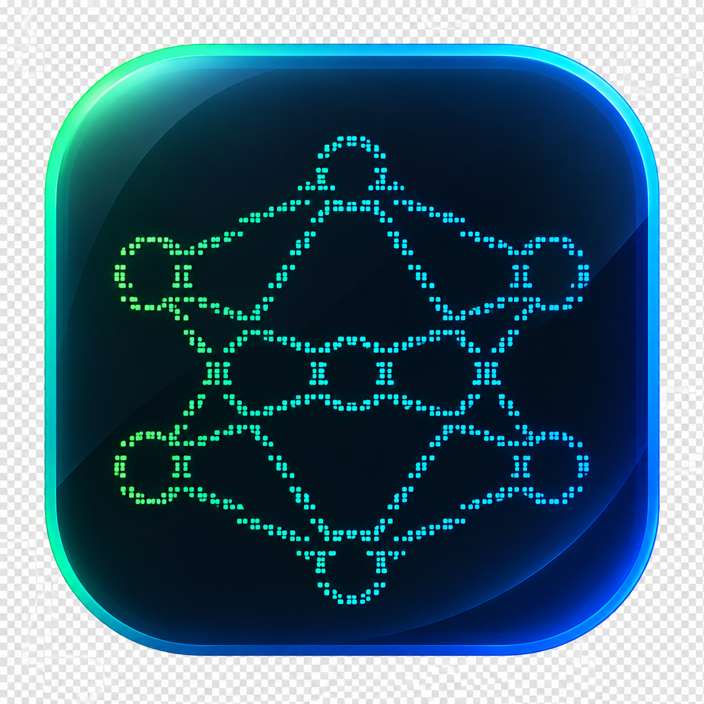
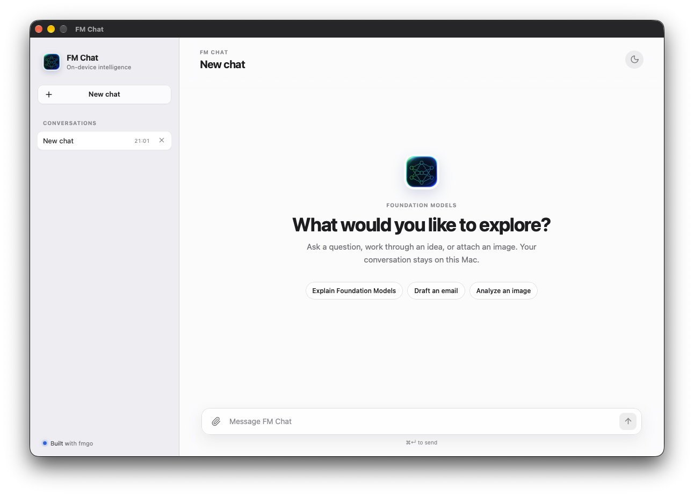
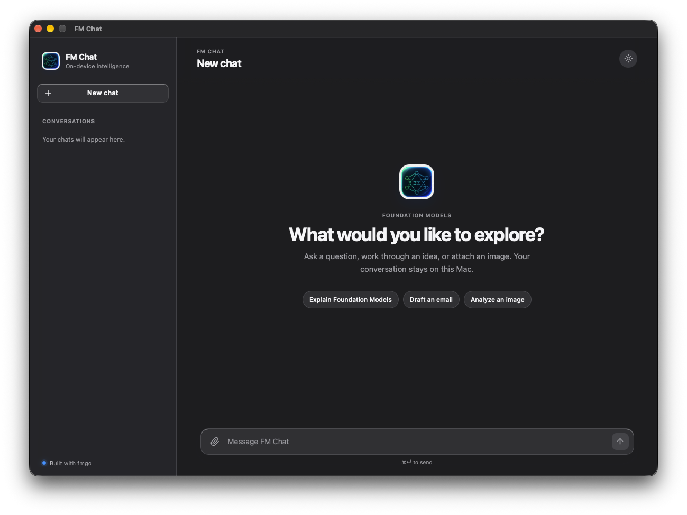

<p align="center">
  
</p>

<h1 align="center">FM Chat</h1>

<p align="center">
  A focused macOS chat for Apple's on-device Foundation Models, powered by <a href="https://github.com/ruanklein/fmgo">fmgo</a>.
</p>

<p align="center">
  <a href="https://www.apple.com/macos/"></a>
  <a href="https://go.dev/"></a>
  <a href="https://wails.io/"></a>
  <a href="https://svelte.dev/"></a>
  <a href="https://github.com/ruanklein/fmgo"></a>
</p>

FM Chat is a small, native-feeling macOS application that demonstrates how to use [fmgo](https://github.com/ruanklein/fmgo), a Go wrapper for the macOS Foundation Models CLI.

It runs the system model on-device, streams responses, persists conversations locally, and keeps selected images inside the app's Application Support directory. No API key, account, or network service is required.

## Preview

<table>
  <tr>
    <td align="center"><strong>Light mode</strong></td>
    <td align="center"><strong>Dark mode</strong></td>
  </tr>
  <tr>
    <td></td>
    <td></td>
  </tr>
</table>

## Features

- On-device Foundation Models through fmgo.
- Streaming responses with an active generation state.
- Local conversation history and image storage.
- Image uploads for multimodal prompts.
- Automatic light/dark appearance with a manual theme toggle.

## Requirements

- macOS 27 or later on Apple Silicon.
- Apple Intelligence enabled.
- Foundation Models CLI terms accepted.
- The native `/usr/bin/fm` command available.

## Development

Install the project dependencies and start the Wails development app:

```sh
wails dev
```

Build the signed local macOS application:

```sh
wails build
```

The frontend can also be checked and built independently:

```sh
cd frontend
npm run check
npm run build
```
